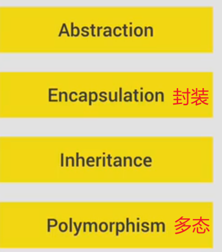
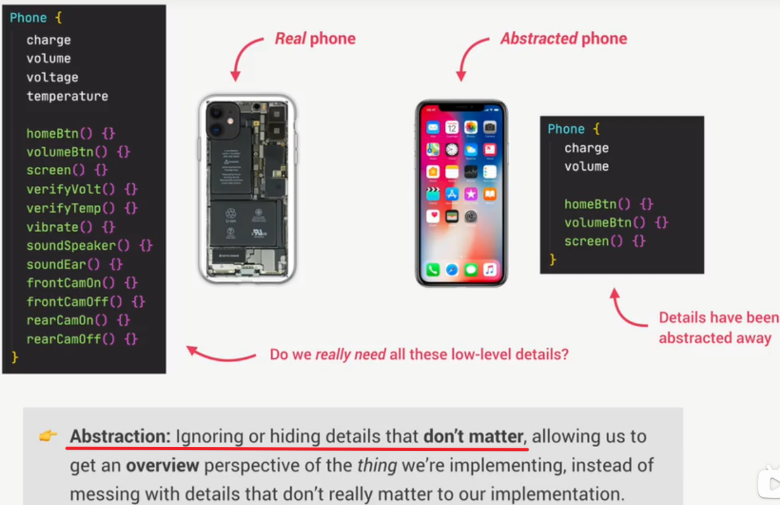
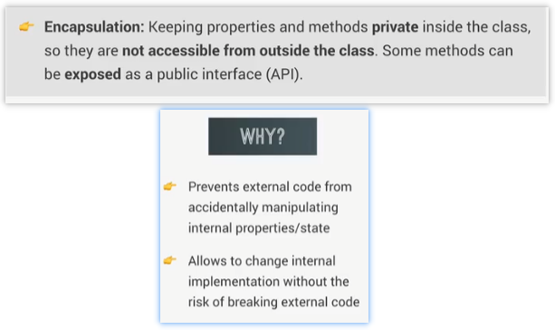
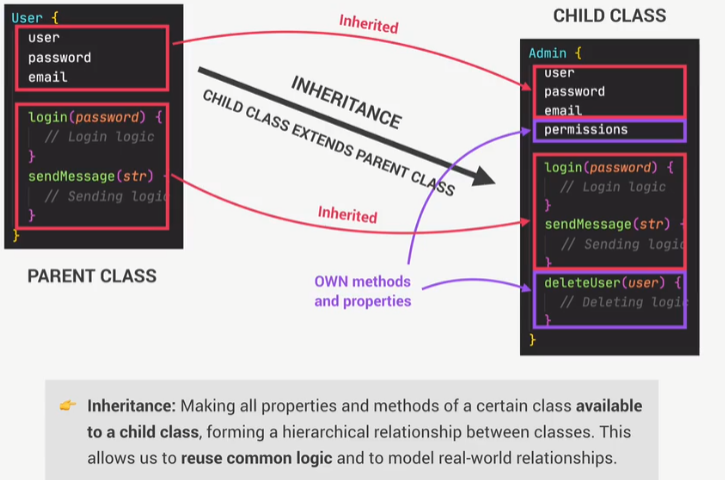
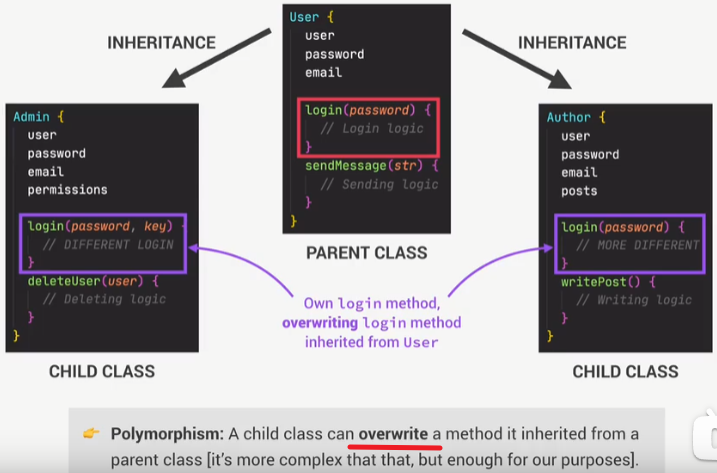
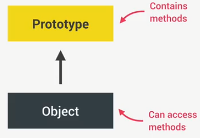
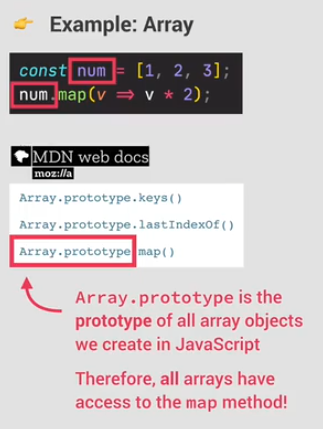

# ES6

## 4 Foundamental principles of OOP

### Abstraction

### Encapsulation:封装性

### Inheritance

### Polymorphism

 

##Prototypes

1.Each object has a prototype.

2.The prototype object contains properties and methods, coz all the object that are linked to that prototype can access and use.

3.This behavior is called prototypal inheritance.

4.We can also say that object delegate~委托~ behavior to the linked to that prototype object.

5.We also call this mechanism delegation.~我们也将这种机制称为委托~

6.This arrow is pointing upwards, objects delegate their behavior to the prototype.

**For example**

Array.prototype is the prototype of the num array, since num is linked to that prototype, therefore, num array has access to all that methods, like the map().

